# Manual de Usuario - Gestión de Gastos

## Inicio

**Descripción:** Al iniciar la aplicacion nos encontramos con un botón para entrar en ella.

---

## Gestion de Cuentas

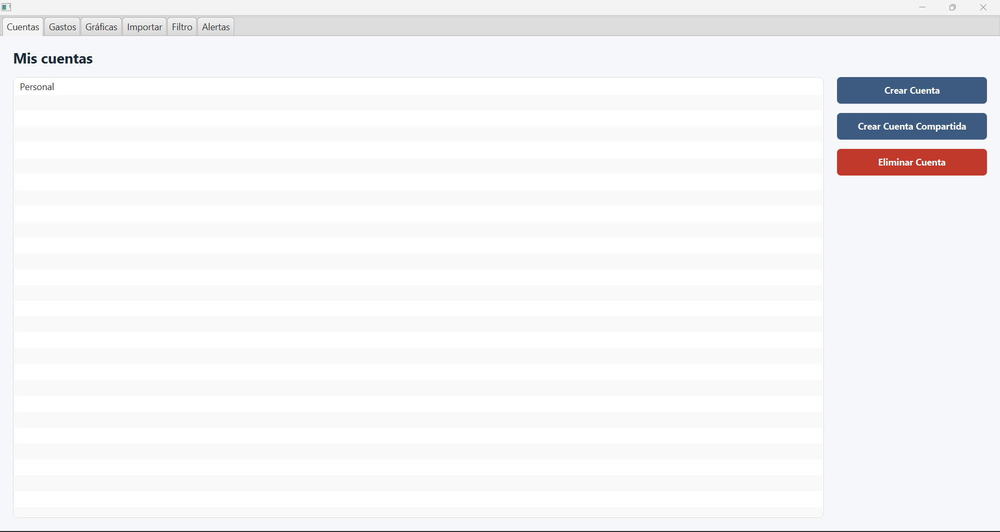

**Descripción:** Al iniciar la app nos encontramos con la selección de cuentas, con una cuenta personal llamada "Personal" está creada por defecto, esta interfaz nos permite realizar 3 operaciones básicas: Crear Cuenta, sirve para crear una cuenta personal escribiendo el nombre de la cuenta, Crear Cuenta Compartida, permite crear una cuenta compartida poniendo nombre a la cuenta y nombres de las personas en ella teniendo la opción de añadir varias personas y si se produce un gasto equitativo o por el contrario porcentual escribiendo el usuario los porcentajes de cada persona, por último Eliminar Cuenta permite eliminar una cuenta seleccionada pidiendo confirmación, si no hay ninguna cuenta seleccionada resultara en un aviso de error.

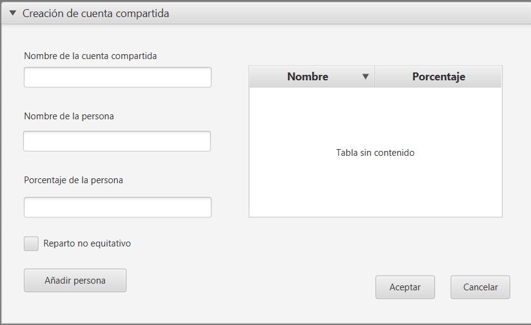

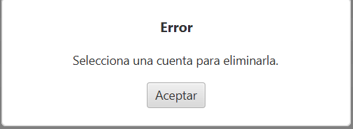

---

## Gestión de Gastos y Categorías

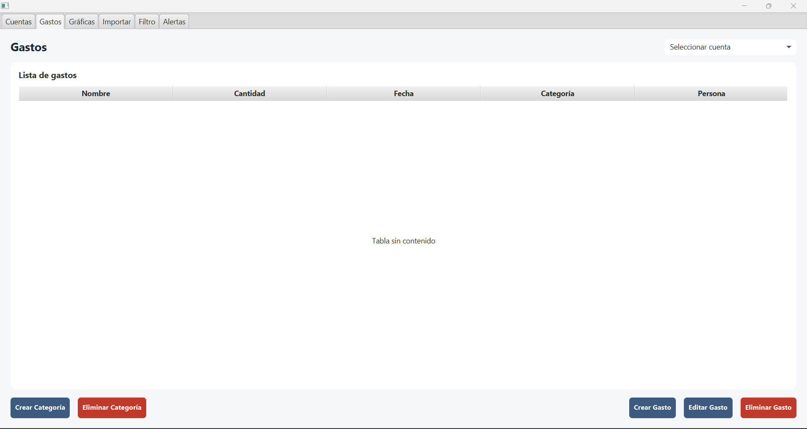

**Descripción:** Para manejar los gastos y categorías tenemos esta pestaña, antes de crear un gasto o categoría tenemos que tener seleccionada una cuenta en el desplegable situado en la parte superior izquierda.

### Crear Gasto 

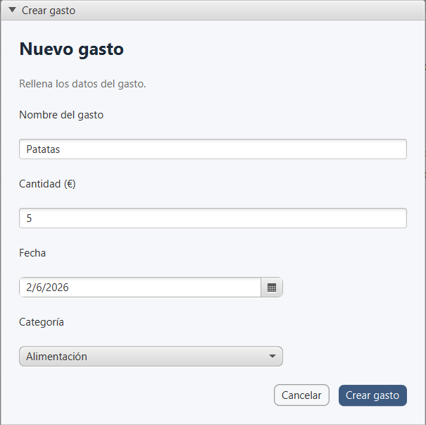

**Descripción:** Al pulsar el botón de Crear Gasto se nos abre una interfaz para rellenar los atributos necesarios de un gasto. Cabe resaltar que al seleccionar fecha se nos abre un desplegable de un calendario y al seleccionar categoría se abre un desplegable con las categorías creadas en la Cuenta. Una vez creado un gasto se ve así.

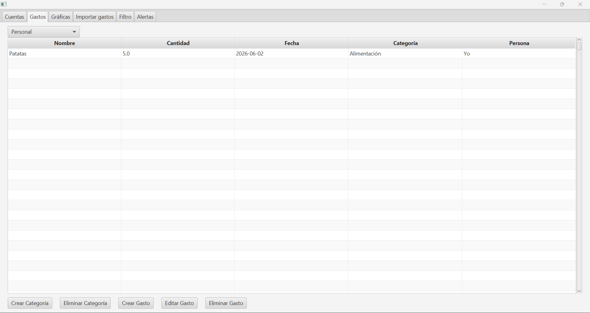

### Eliminar Gasto

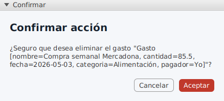

**Descripción:** Al igual que eliminar cuenta hay que seleccionar un gasto previamente y nos pedirá confirmación para eliminarlo.

### Editar Gasto

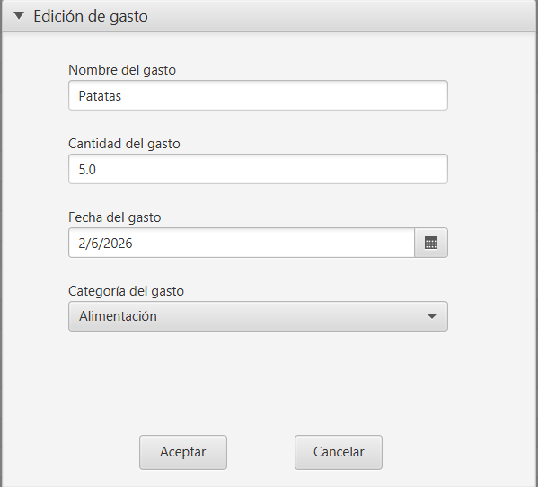

**Descripción:** Al seleccionar un gasto con este botón nos vuelve a abrir el desplegable que había al crear un gasto y nos permite modificar sus atributos.

### Crear Categoría

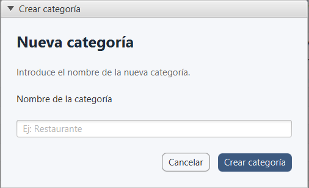

**Descripción:** Al seleccionar este botón nos permite crear una nueva categoría escribiendo el nombre que queramos darle.

### Eliminar Categoría

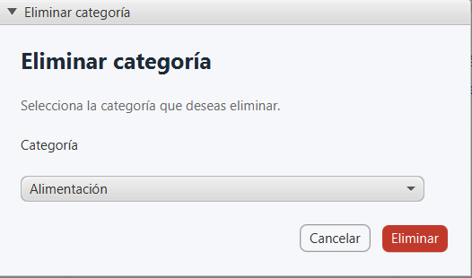

**Descripción:** Al seleccionar este botón nos permite eliminar una categoría ya existente seleccionándola dentro de un desplegable con las categorías existentes.

---

## Importar Gastos

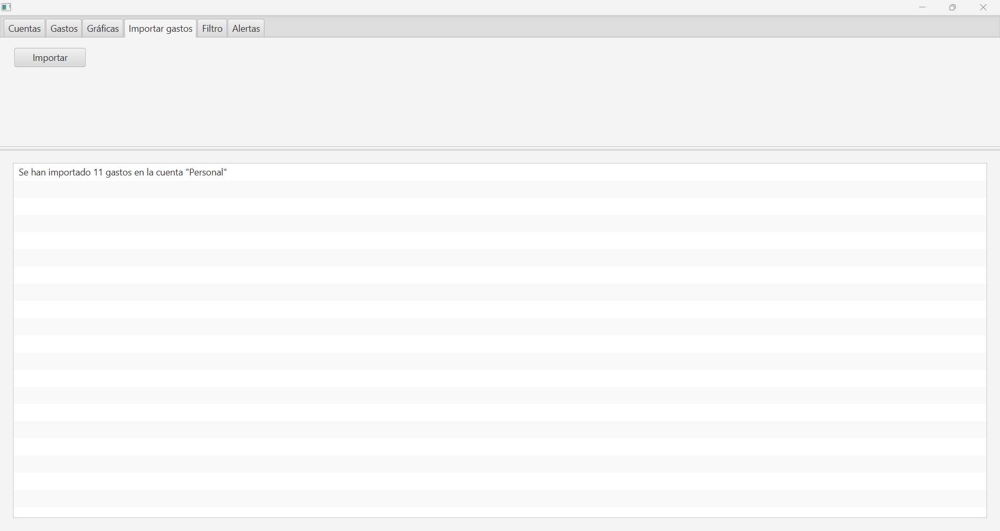

**Descripción:** En esta interfaz se nos permite importar una lista de gastos; para ello hay que pulsar el botón Importar, esto nos abrirá el explorador de archivos para seleccionar el archivo con los gastos que queramos importar (NOTA: Actualmente la aplicación solo permite archivos en formato CSV para su importación). Cuando se han importado aparecerá un aviso con el número de gastos importado y a qué cuenta.

---

## Graficas de Gastos

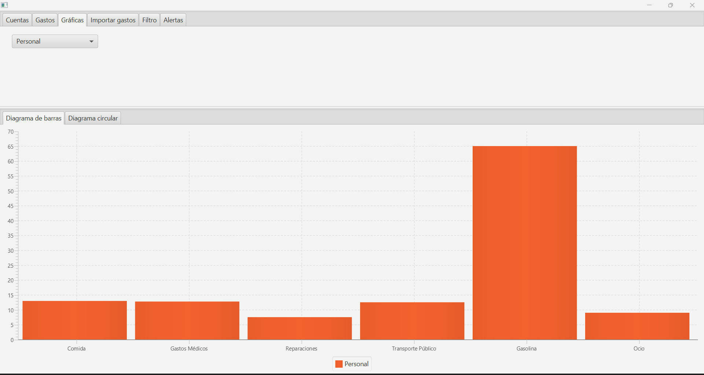

**Descripción:** En esta interfaz se pueden ver gráficas que agrupan los gastos de una cuenta por Categorías, ya sea en diagrama de barras o también en opción de generar un diagrama circular.

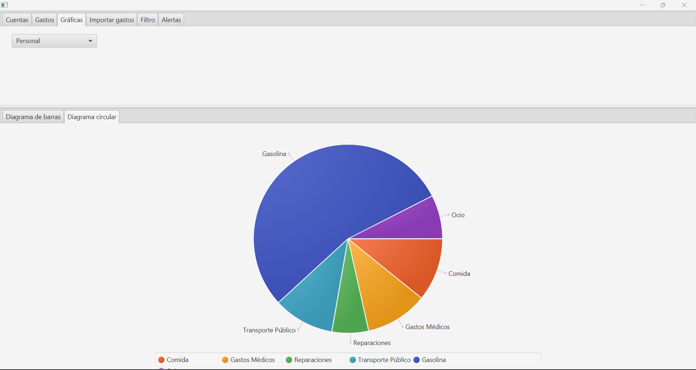

---

## Filtros

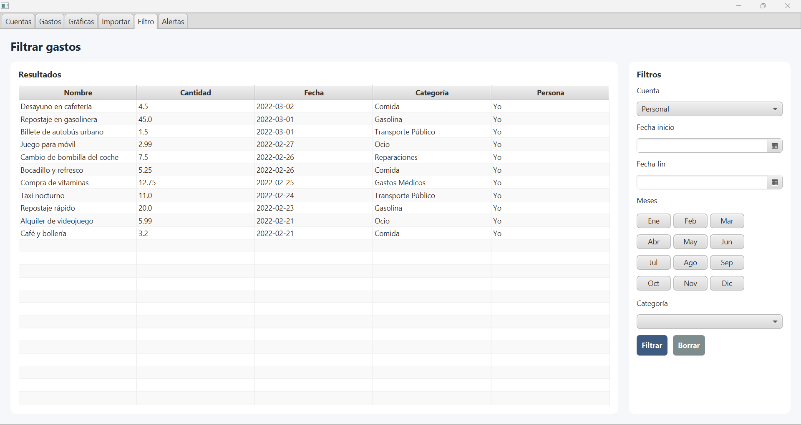

**Descripción:** En esta interfaz se pueden filtrar los gastos de las cuentas por un rango de fechas, haber sido realizados en meses concretos, por categoría del gasto o por una combinación de estos filtros; a la izquierda nos saldrá un listado con los gastos que cumplen el filtrado.

---

## Alertas y Notificaciones