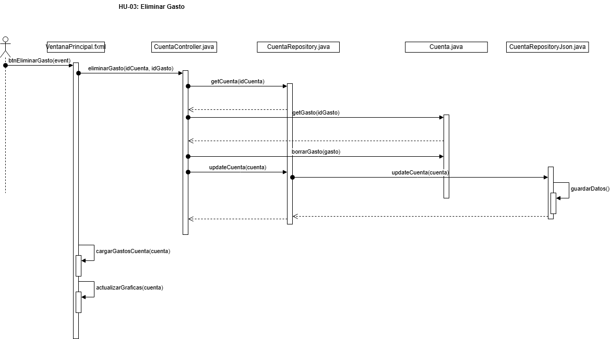

# Diagrama De Interacción

Se ha selecionado la **HU-03 Eliminar Gasto** ya que representa el flujo principal de la aplicación 

**Descripción:**

- 1: Primero la capa de vista recibe el evento, valida el evento y delega al controlador "CuentaController.java"
- 2: El controlador se encarga del proceso recibe los datos y se encarga de recuperar la Cuenta correspondiente gracias a los repositorios
- 3: Una vez con la Cuenta en concreto se pide el gasto usando la cuenta, aqui se aprecia perfectamente el patrón GRASP, ya que es la clase Cuenta la que se encarga de manejar los objetos de tipo gasto y no es el controlador en si sino que se lo delega a Cuenta, esta recupera el gasto y lo eliminar
- 4: Ahora se guarda los cambios realizados para la Persitencia para ello se delega en CuentaRepository y esta en CuentaRepositoryJSON
- 5: Por ultimo el sistema "actualiza" los gastos y graficas con las llamadas a cargarGastosCuenta(cuenta) y actualizarGraficas() métodos que no se han desarrollado en la gráfica para su facilidad de compresión ya que ya representaba el flujo principal de la aplicación perfectamente.
