# Manual de Usuario - Gestión de Gastos

## Inicio

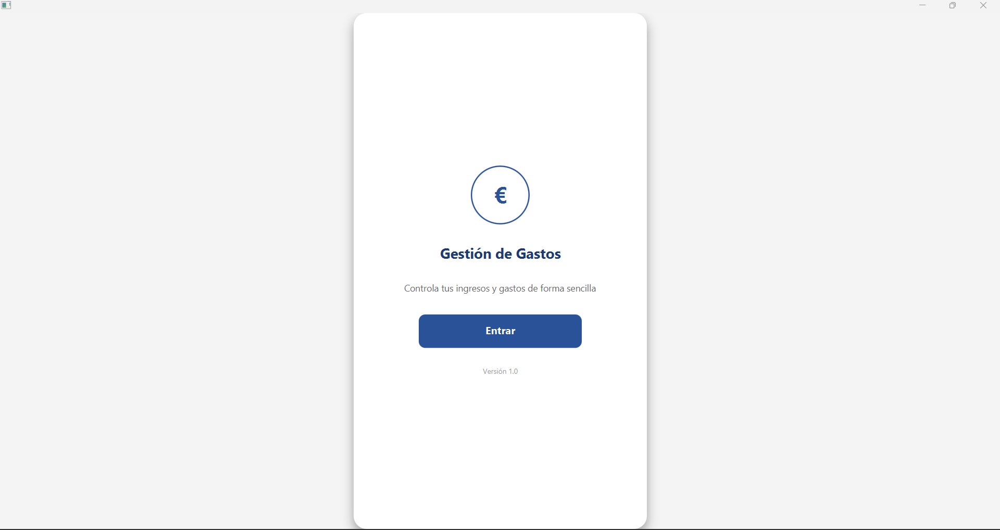

**Descripción:** Al iniciar la aplicación nos encontramos con un botón de "Entrar" para acceder a ella.

---

## Gestión de Cuentas

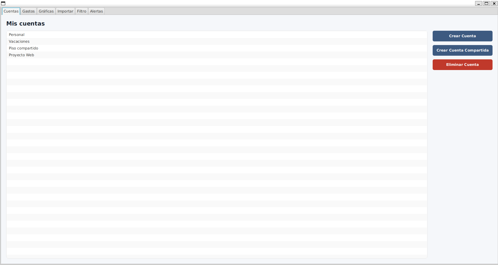

**Descripción:** Al entrar en la aplicación nos encontramos con la lista de cuentas. La cuenta personal llamada "Personal" está creada por defecto. Seleccionando una cuenta haciendo doble click sobre ella, se muestra un resumen de su información básica, con la cantidad gastada total, el número de gastos registrados y los límites semanales y mensuales que tiene establecidos. Además, para las cuentas compartidas se muestran los participantes con sus respectivos porcentajes de participación.

| Resumen cuenta personal | Resumen cuenta compartida |
|-------------------------|---------------------------|
| 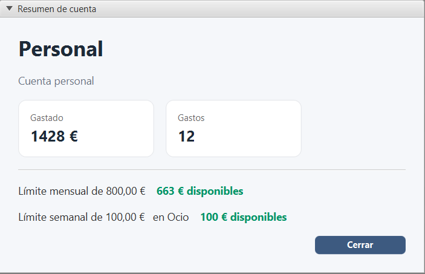 | 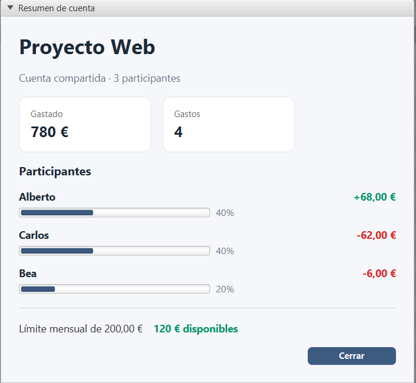 |

Esta interfaz presenta también tres botones a la derecha que nos permiten realizar las siguientes operaciones básicas:

### Crear Cuenta

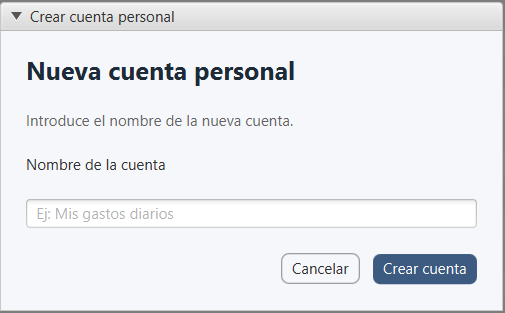

**Descripción:** Proporcionando un nombre válido (no repetido), se crea una cuenta personal.

### Crear Cuenta Compartida

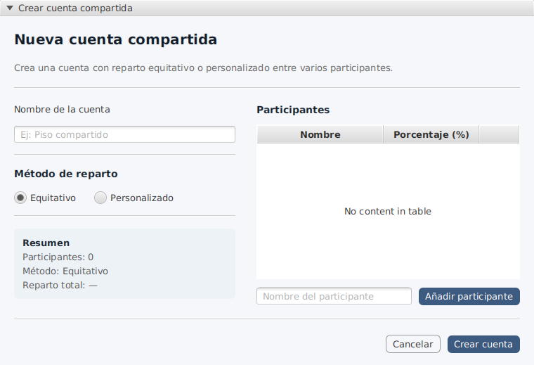

**Descripción:** Proporcionando un nombre válido (no repetido) y al menos un participante, se crea una cuenta compartida.
 Por defecto se aplica un reparto equitativo entre los miembros, aunque también está la opción de aplicar un reparto personalizado, escribiendo para cada persona su porcentaje de gastos.

| Reparto equitativo | Reparto personalizado |
|--------------------|-----------------------|
|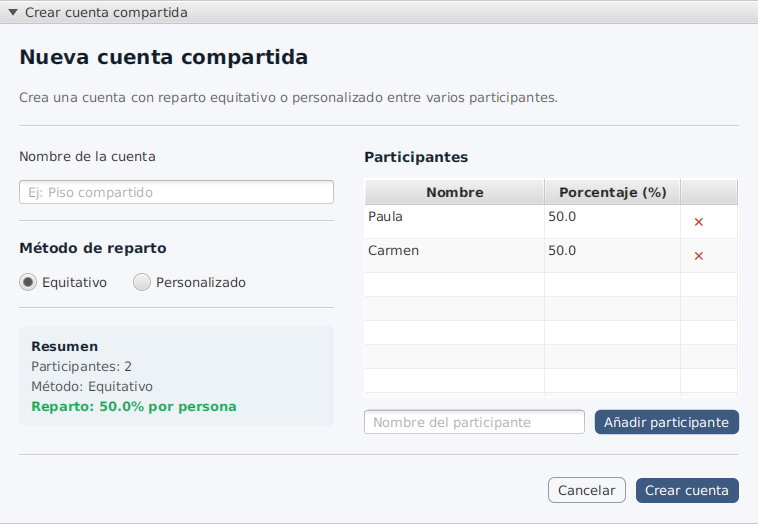 | 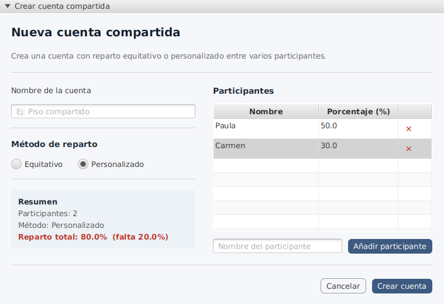 |

### Eliminar Cuenta

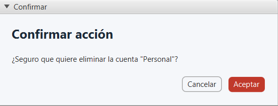

**Descripción:** Permite eliminar una cuenta seleccionada pidiendo confirmación.

---

## Gestión de Gastos y Categorías

**Descripción:** Para manejar los gastos y categorías tenemos esta pestaña, antes de crear un gasto o categoría tenemos que tener seleccionada una cuenta en el desplegable situado en la parte superior izquierda.

| Gastos cuenta personal | Gastos cuenta compartida |
|------------------------|--------------------------|
|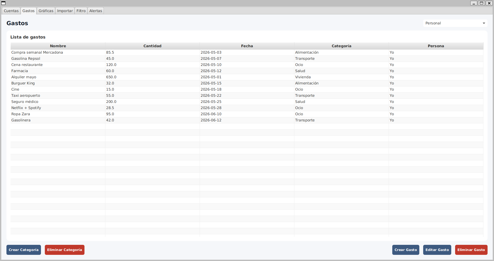 | 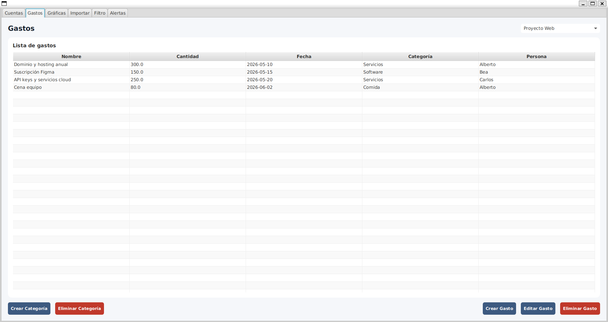 |

### Crear Gasto

| Crear gasto en cuenta personal | Crear gasto en cuenta compartida |
|--------------------------------|----------------------------------|
|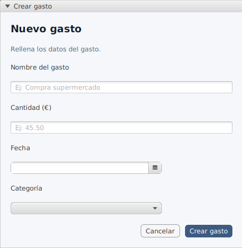 | 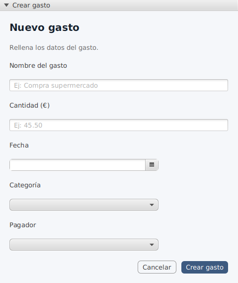 |

**Descripción:** Al pulsar el botón de Crear Gasto se abre una pestaña para rellenar los atributos necesarios de un gasto. Cabe resaltar que al seleccionar fecha se muestra un desplegable de un calendario y al seleccionar categoría se abre un desplegable con las categorías creadas en la cuenta, de igual forma para el pagador en una cuenta compartida.

| Calendario | Categorías | Pagador |
|------------|------------|---------|
|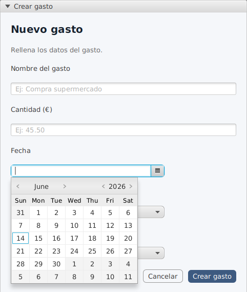 | 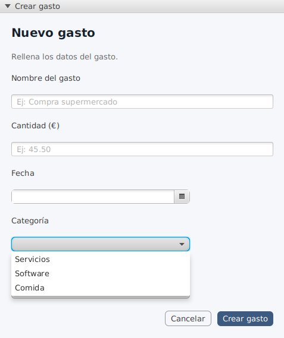 | 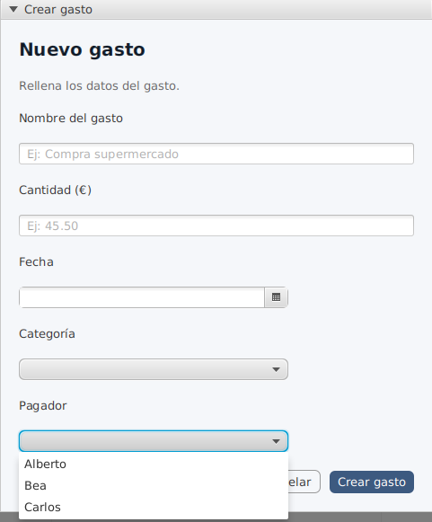 |

### Eliminar Gasto

**Descripción:** Al igual que eliminar cuenta, hay que seleccionar un gasto previamente y nos pide confirmación para eliminarlo.

### Editar Gasto

| Editar gasto en cuenta personal | Editar gasto en cuenta compartida |
|---------------------------------|-----------------------------------|
|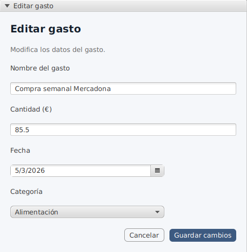 | 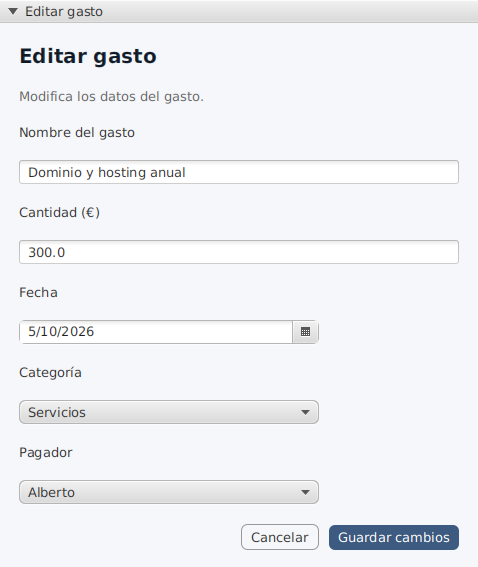 |

**Descripción:** Al seleccionar un gasto y pulsar el botón "Editar Gasto", se abre la misma pestaña que la de crear un gasto y nos permite modificar sus atributos.

### Crear Categoría

**Descripción:** Al seleccionar este botón nos permite crear una nueva categoría escribiendo el nombre que queramos darle.

### Eliminar Categoría

**Descripción:** Al seleccionar este botón, podemos eliminar una categoría existente y vacía (sin gastos registrados), seleccionándola dentro del desplegable con las diferentes categorías de la cuenta. Como con el resto de opciones de eliminación, antes de borrar la categoría se muestra un mensaje de confirmación.

---

## Gráficas de Gastos

| Diagrama de barras | Diagrama circular |
|--------------------|-------------------|
|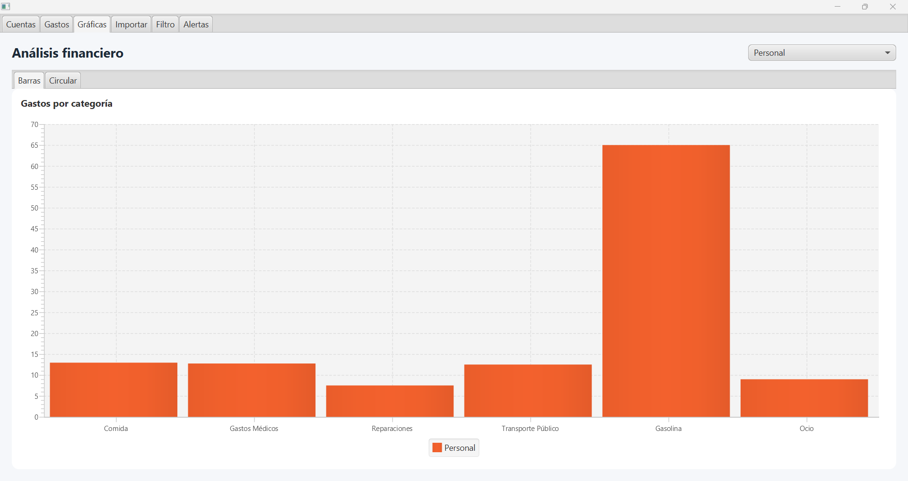 | 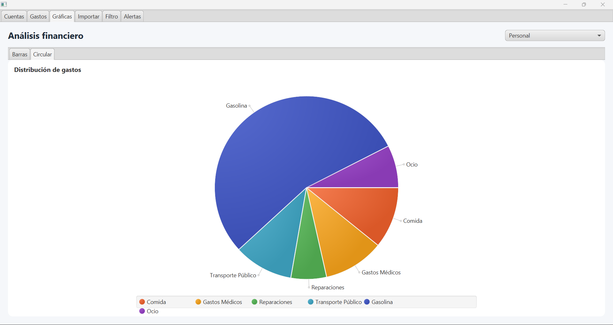 |

**Descripción:** En esta pestaña se pueden ver gráficas que agrupan los gastos de una cuenta por categorías. El desplegable para seleccionar la cuenta se encuentra arriba a la derecha y la gráfica está disponible en formato de diagrama de barras y diagrama circular.

---

## Importar Gastos

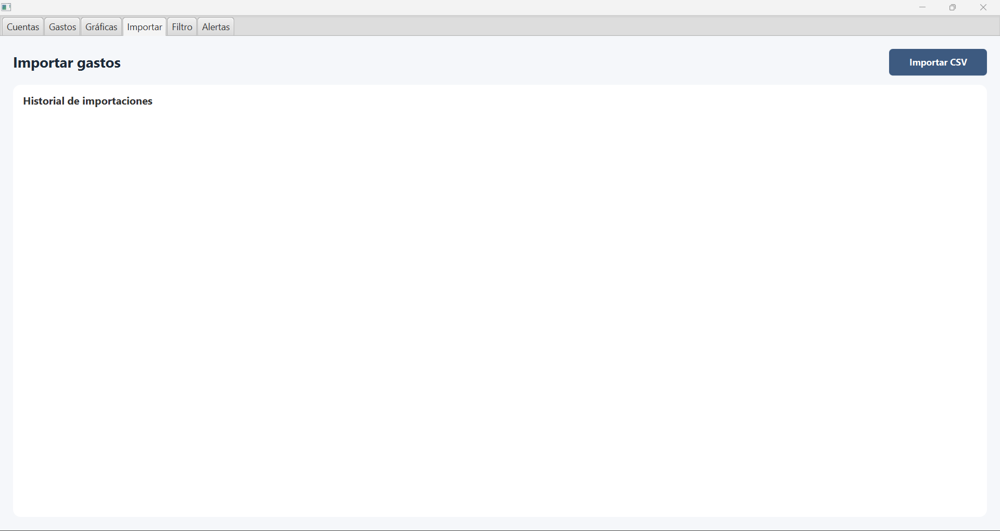

**Descripción:** En esta pestaña se nos permite importar una lista de gastos; para ello hay que pulsar el botón "Importar" y seleccionar la cuenta y el archivo deseado.

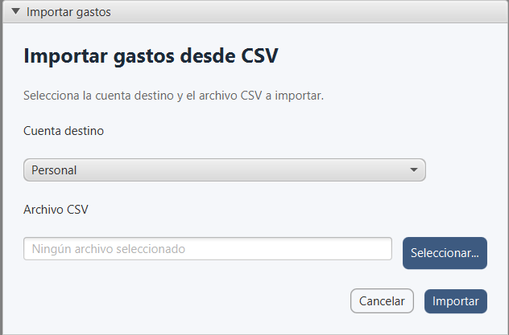
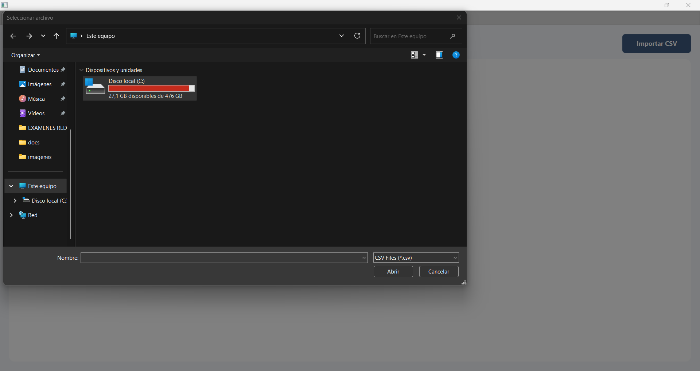

**Descripción:** El botón de "Seleccionar..." abre el explorador de archivos para seleccionar el archivo con los gastos que queramos importar (NOTA: Actualmente la aplicación solo permite archivos en formato CSV para su importación). Cuando se han importado correctamente los gastos, aparece un mensaje informativo en el historial de importaciones.

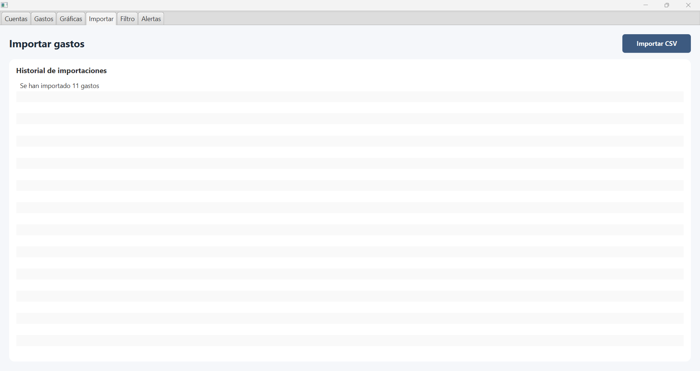

---

## Filtros

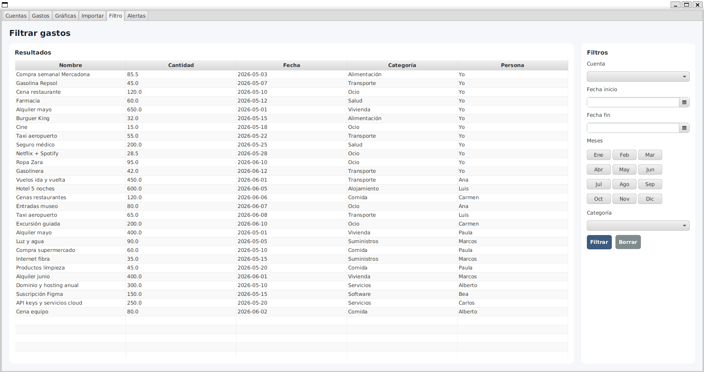

**Descripción:** En esta interfaz se pueden filtrar los gastos de las cuentas por la cuenta a la que pertenecen, por un rango de fechas, por haber sido realizados en meses concretos, por la categoría del gasto o por una combinación de estos filtros, además, una vez que se ha seleccionado una cuenta específica y si esta es compartida, también aparece la opción de filtrar por pagador. Cuando se seleccionan los filtros y se pulsa el botón de "Filtrar", se muestra a la izquierda un listado con los gastos que cumplen el filtrado. Si no hay filtros activos o se pulsa el botón de "Borrar", se muestra la lista con todos los gastos existentes.

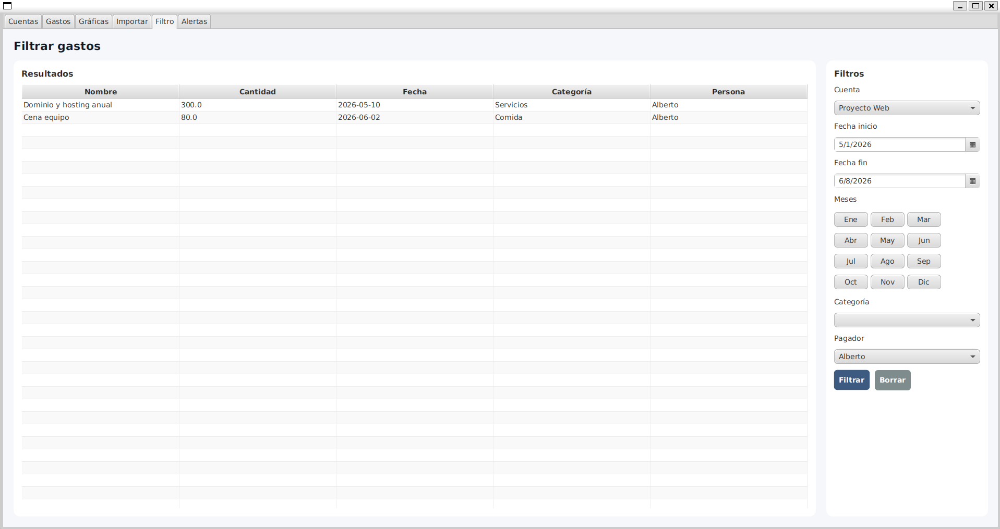

---

## Alertas y Notificaciones

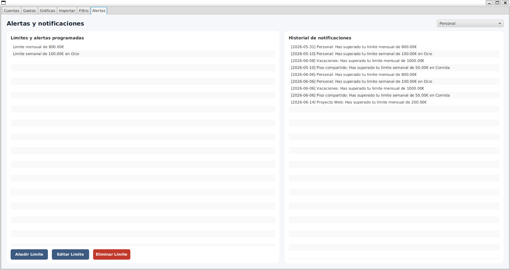

**Descripción:** En esta última pestaña se pueden ver los límites que hay establecidos para cada cuenta, además de crearlos, editarlos y eliminarlos; y, a la derecha, se muestra un historial con las notificaciones de las alertas de los límites que se han superado.

### Añadir Límite

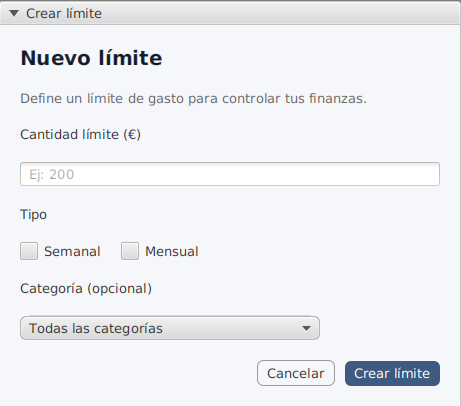

**Descripción:** Al pulsar el botón de "Añadir Límite", aparece una pestaña donde podemos crear una nueva alerta asignando su cantidad y si es semanal o mensual. Por defecto se aplica sobre todas las categorías, pero también se puede seleccionar una categoria de gasto concreta en el desplegable.

### Editar Límite

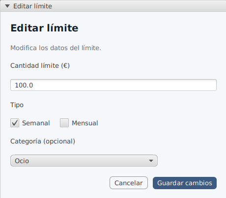

**Descripción:** Esta pestaña nos permite modificar la cantidad, el tipo (semanal o mensual) o la categoría de un límite existente.

### Eliminar Límite

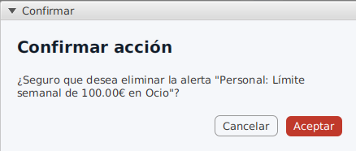

**Descripción:** Al pulsar este botón nos salta un mensaje de confirmación para eliminar el límite seleccionado.

---

## Terminal

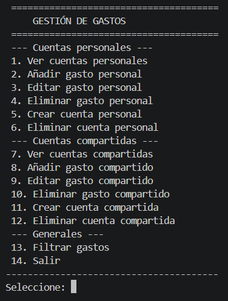

**Descripción:** Adicionalmente, el programa se puede usar desde la terminal sin necesidad de lanzar la interfaz gráfica.
